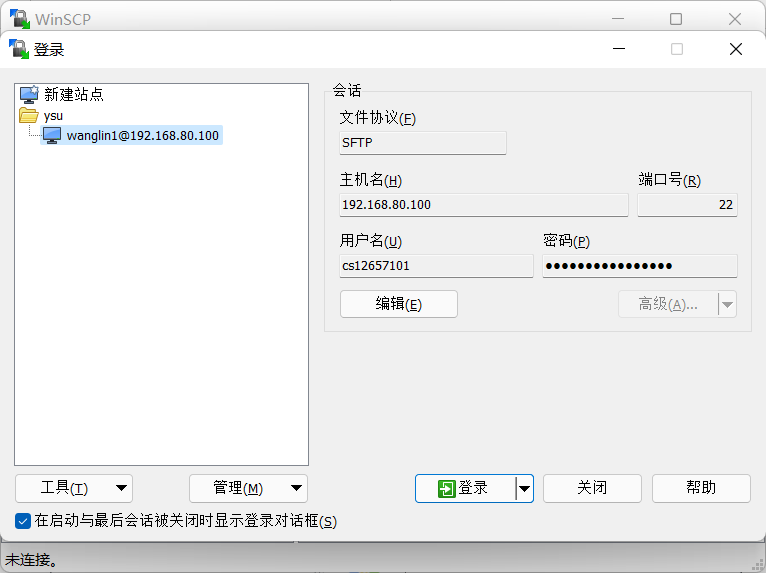
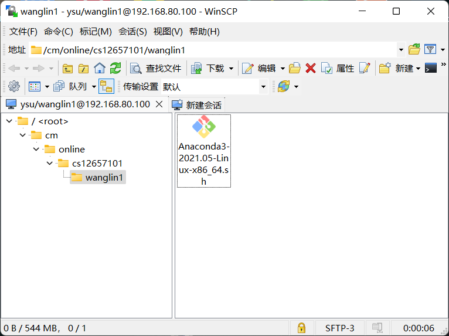
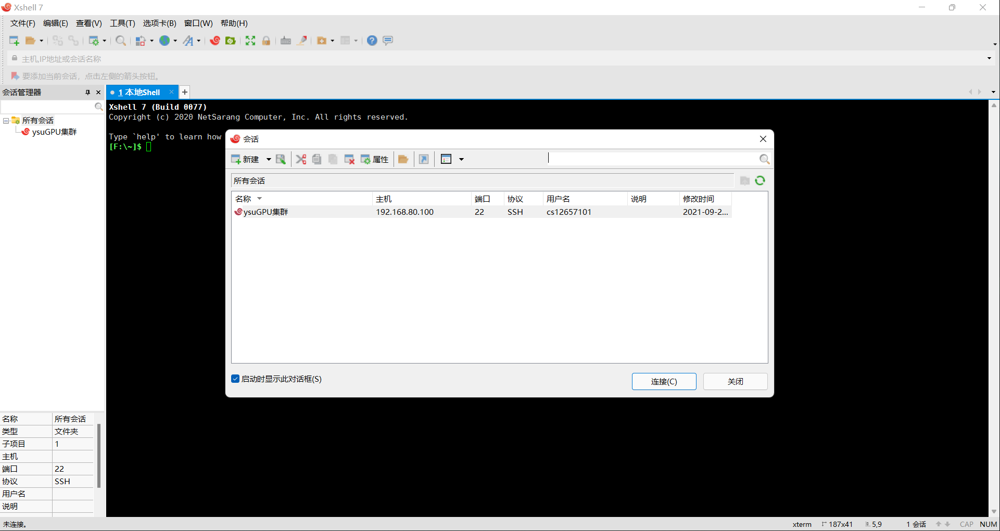
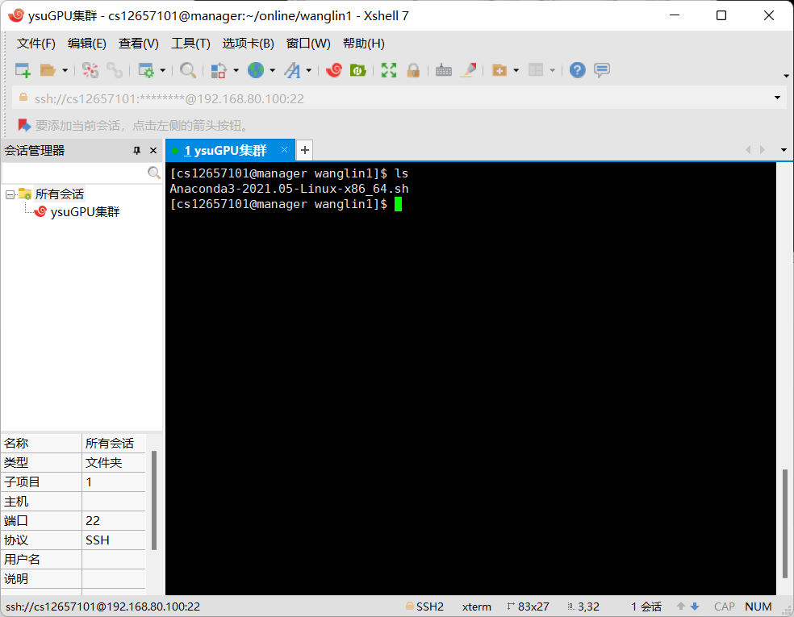
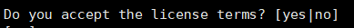
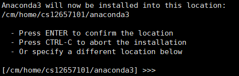
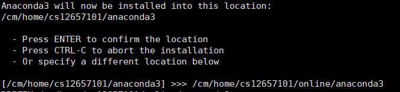
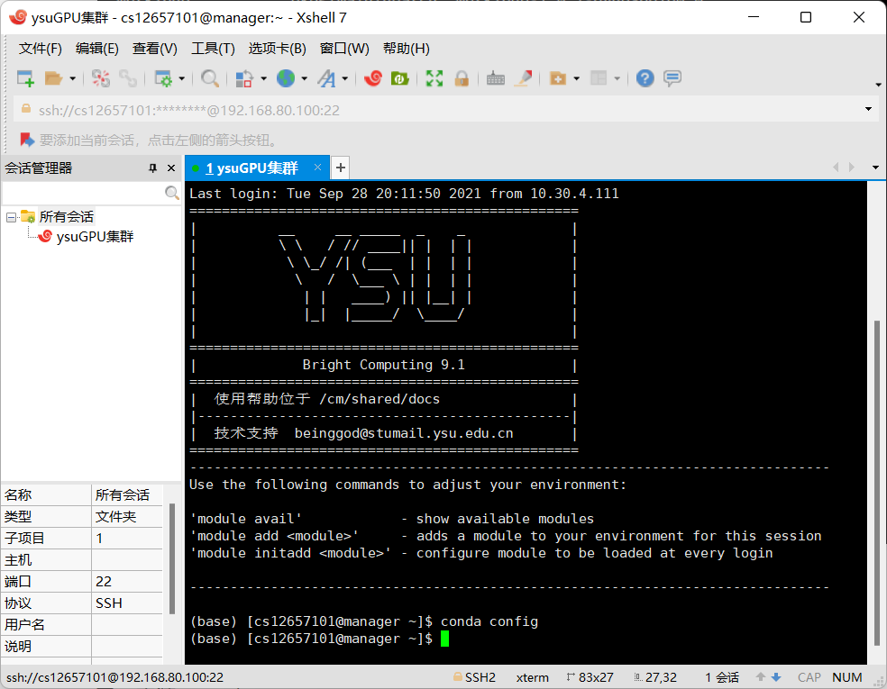
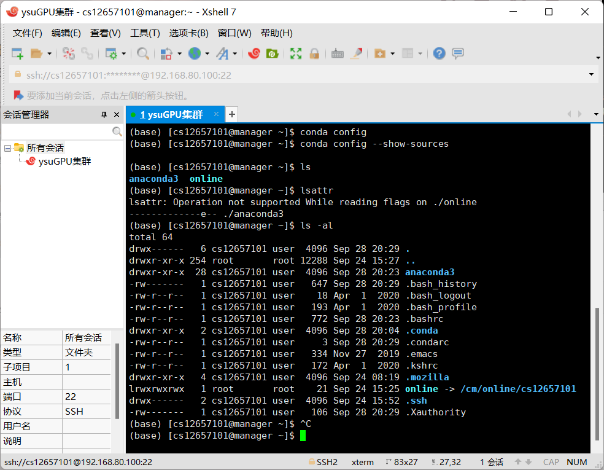
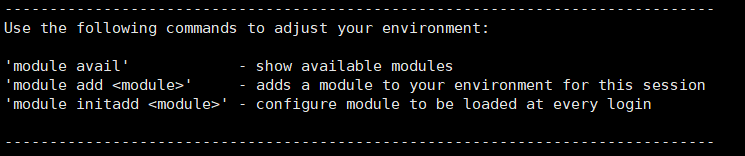

# 集群使用教程

### 一、下载

下载 Anaconda3（版本随意）

地址：https://repo.anaconda.com/archive/Anaconda3-2021.05-Linux-x86_64.sh。

下载 WIN SCP（版本随意）

地址：https://winscp.net/download/WinSCP-5.19.2-Setup.exe。

下载 XShell7（版本随意）

地址：https://xshell.en.softonic.com/download。

### 二、安装和配置Anaconda

1.使用 WIN SCP登录集群。



2.把下载好的Anaconda3-2021.05-Linux-x86_64.sh文件上传（拖拽即可）到online/<用户名>文件夹中，图中<用户名>为cs12657101。



3.打开XShell7，使用用户名密码登录集群。



4.安装anaconda。

使用命令切换路径：

```shell
# 从 ~目录切换到wanglin1目录下
cd online/wanglin1
```

在该目录下使用命令：

```shell
ls
```

可以看到我们之前拖拽上传的anaconda安装包。



之后，使用如下命令进行安装：

```shell
sh Anaconda3-2021.05-Linux-x86_64.sh
```

一路回车，直到出现提示：



输入yes后，出现：



修改安装路径后回车



等待出现如下界面：


一直yes（上图为倒数第二个yes），最后等待安装完毕即可。

安装完毕后，请重启XShell7，重新登录一遍集群，此时你会发现，前面出现了一个(base),这证明你安装成功了。



5.修改anaconda镜像源。

（1）在~（home）路径下，使用命令：

```shell
vim .condarc # vim 编辑.condarc
```

之后键盘输入i，进入编辑模式。将下面的内容复制进去。

```shell
channels:
  - defaults
show_channel_urls: true
default_channels:
  - https://mirrors.tuna.tsinghua.edu.cn/anaconda/pkgs/main
  - https://mirrors.tuna.tsinghua.edu.cn/anaconda/pkgs/r
  - https://mirrors.tuna.tsinghua.edu.cn/anaconda/pkgs/msys2
  - https://mirrors.tuna.tsinghua.edu.cn/anaconda/cloud/conda-forge
  - https://mirrors.tuna.tsinghua.edu.cn/anaconda/cloud/pytorch
```

复制完毕后，键盘输入:wq，退出编辑模式。

（2）在~（home）目录下，使用命令：

```shell
ls -al
```

可以查看到.condarc文件。



（3）使用命令同样也可以查看镜像源：

```shell
conda config --show-sources # 查看镜像源
```

### 三、安装pytorch

(1)使用如下命令安装pytorch：

```shell
conda install pytorch torchvision torchaudio cudatoolkit=11.1
```

(2)base环境的包可能比较陈旧，这种情况下在base环境中安装cuda11.1会报错（依赖冲突），所以我们要更新conda。

更新conda 使用下面这个命令：

```shell
conda update
```

弹出提示：


把提示中显式的下面这个命令运行一下，更新环境即可（yes）：

```shell
conda update --prefix <路径> anaconda
```

更新完毕后再安装pytorch就不会有问题了。

(3)如果你自己重新建立一个环境，也可以解决该问题。

建立环境命令：

```shell
conda create --name test python=3.8 # 环境名称为test，使用python3.8
```

切换环境命令：

```shell
conda activate test # test为环境名称。
```

### 四、运行（sbatch）

1.编写脚本

编写一个.sh文件，假设文件名为test.sh，在test.sh中写入如下内容：

```bash
#!/bin/bash
#SBATCH -J JobName	#作业名为JobName
#SBATCH -o Job.out	#标准输出重定向到Job.out
#SBATCH -N 1	#作业申请1个节点
#SBATCH --ntasks-per-node=1	#单节点启动任务数为1
#SBATCH --cpus-per-task=1	#单任务使用的CPU核心数为1
#SBATCH -t 1:00:00	#任务运行时间最长为1小时，可以不写
#SBATCH --gres=gpu:1	#单个节点使用一块GPU卡
#SBATCH --mail-type=END	#作业结束时发送邮件
#SBATCH --mail-user=xxx@xx.xx	#邮箱地址
#SBATCH -p dlq	#dlq分区        
python main.py	#运行作业
```

注意：最后一行运行项目只需要运行你的主程序即可，你的test.sh应该与main.py在同一目录下，不在一起请修改最后一行的运行路径。理所当然，你的项目也应该通过winscp上传到online文件夹中。

2.提交任务

```shell
sbactch test.sh
```

3.查看任务

```shell
squeue
```

4.取消任务

```
scancel <作业ID>
```

作业 ID可以通过squeue查看得到。

5.监控运行

这里提供一个日志包，使用log而非print进行输出打印。

https://github.com/metachris/logzero

### 注意事项

1.TensorFlow没有尝试过，理论上换汤不换药。

2.conda安装依赖命令：

```shell
conda install --yes --file requirements.txt
```

3.你也可以不用anaconda，集群中有很多现成的软件，可以直接加载到环境中。



第一行的命令可以查看所有可以用的软件，第二行就是加载软件，第三行就是每次启动都自动加载环境。

这些命令麻烦加到main.py开头。

4.dataloader的num_workers参数请设置为1。

### 关于

作者：徐荣楠

最后更新时间：2021.9.29

联系方式：

​	QQ:572249217

​	微信：xrn1997
